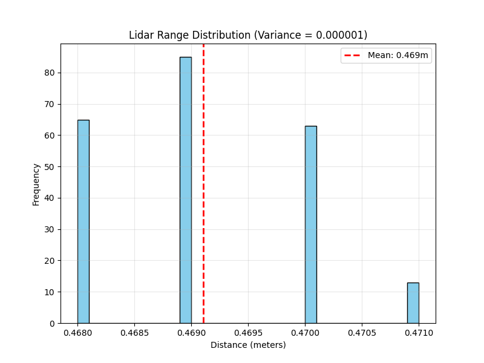
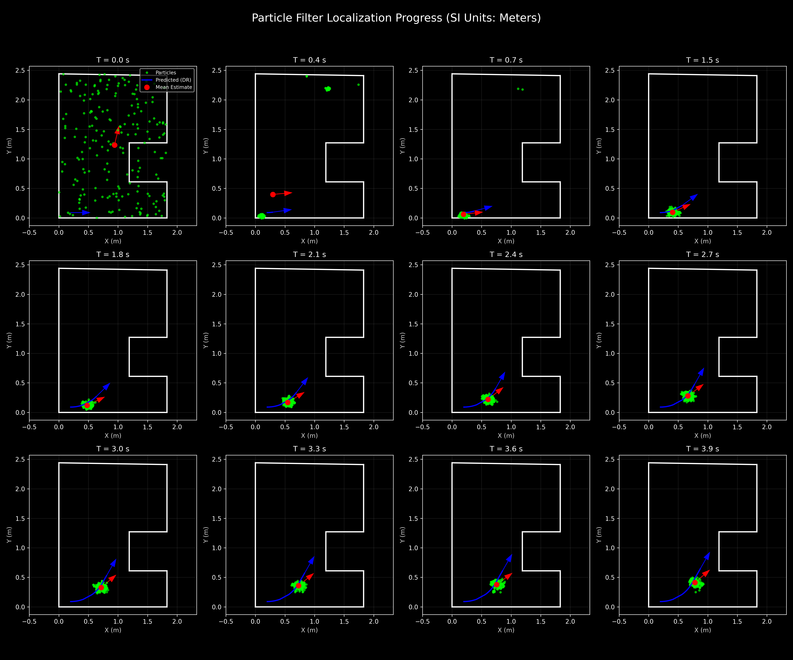
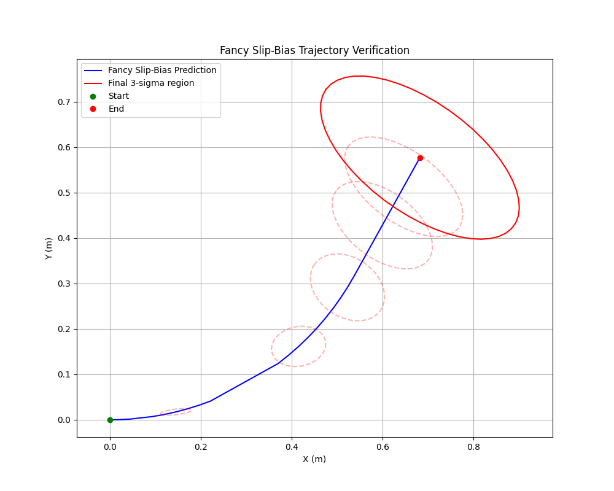

# Lab 04 Report: Particle Filter Localization

## Abstract
This report documents the implementation and characterization of a Monte Carlo Localization (MCL) system, commonly referred to as a Particle Filter, for a mobile robot. The system leverages a LIDAR sensor and wheel odometry to estimate the robot's pose within a known map. The experimental results demonstrate robust global localization and recovery from the "kidnapped robot" scenario. Performance was further enhanced through computational optimizations of the trigonometric calculations and batch rendering of the sensor data.

## Introduction
The primary objective of this laboratory exercise was to implement a robust localization system capable of determining a robot's pose without prior knowledge of its initial position (global localization) and maintaining this estimate despite abrupt changes in pose (kidnapped robot problem). Particle Filters offer a probabilistic approach to this problem, representing the state distribution through a set of weighted samples. This method is particularly effective in non-linear systems and non-Gaussian noise environments typical of indoor robot navigation.

## Methodology

### LIDAR Characterization
Before implementing the particle filter, the LIDAR sensor's noise characteristics were empirically determined. The robot was placed at a fixed distance from a flat wall, and range measurements were collected at a constant angle of $0^\circ$ for a duration of 10 seconds. 

The range distribution was analyzed to calculate the distance variance, which is a critical parameter for the sensor model's likelihood function. The characterization process resulted in a distance variance of $5.62 \times 10^{-6} \text{ m}^2$.

**Figure 1: LIDAR range distribution and calculated variance.**

### Motion Model Tuning
The motion model was tuned using a "Fancy Slip-Bias" approach, accounting for wheel slip and steering inaccuracies. Data was collected through two primary experiments: 
1. **Straight Line Trials:** To map encoder counts to linear distance and estimate distance variance.
2. **Circular Trials:** To map encoder-steering products to yaw rates and estimate angular variance.

The following coefficients were derived from the experimental data:
- **Distance Coefficient ($K_{SE}$):** $-5.4066 \times 10^{-4} \text{ m/count}$
- **Distance Variance Coefficient ($K_{SS}$):** $1.0881 \times 10^{-6} \text{ m}^2\text{/count}$
- **Yaw Rate Coefficient ($C_R$):** $5.8765 \times 10^{-5} \text{ rad/s per count-steering/s}$
- **Angular Variance ($\sigma_{w}^2$):** $5.8214 \times 10^{-2} \text{ (rad/s)}^2$

These parameters were integrated into the `parameters.py` configuration to ensure the motion model accurately predicted the particle distribution's spread over time.

### Particle Filter Implementation
The filter was initialized with a uniform distribution of 400 particles across the map's bounds. The update loop follows the standard MCL steps:
1. **Prediction:** Particles are propagated using the motion model and the robot's odometry signals.
2. **Correction:** Each particle's likelihood is calculated based on how well its expected LIDAR rays match the actual LIDAR signal.
3. **Resampling:** A new set of particles is drawn based on the calculated weights using importance sampling.

#### Sensor Model and Weighting
The log-likelihood of each particle was calculated by comparing actual LIDAR distances with expected distances computed through ray-casting against a known map. To maintain real-time performance, the LIDAR signal was subsampled to 45 rays per update. 

The sensor model incorporated several robustification measures:
- **Environmental Uncertainty:** A variance buffer of $5.0 \times 10^{-3} \text{ m}^2$ was added to the empirical LIDAR variance to account for map inaccuracies and environmental noise.
- **Log-Weight Averaging:** The total log-likelihood was averaged by the number of valid rays to prevent the weight from becoming disproportionately sensitive to the number of LIDAR rays.
- **Map Boundary Constraint:** Particles were constrained within a $[ -0.5, 3.0 ]$ meter coordinate box to prevent divergence into mathematically invalid regions while allowing sufficient buffer for recovery.
- **Numerical Protection:** Explicit checks for `NaN` and infinite values were implemented to ensure the stability of the particle state during integration.

#### Kidnapped Robot Detection
The system monitors the maximum log-weight among all particles. If this weight drops below a threshold of -6.0, the robot is assumed to be "kidnapped." In this event, the particle set is reset to a uniform distribution across the entire workspace, enabling global re-localization.

## Experimental Results

### Global Localization
From a random initial pose, the particle set quickly converged to the true pose of the robot. This convergence is visible in the transition from a dispersed particle cloud to a tight cluster around the estimated mean.

**Figure 2: Time-series snapshots of the particle filter converging from a uniform distribution.**

### Trajectory Tracking
The robot successfully navigated the environment, maintaining an accurate pose estimate throughout the trial. 

**Figure 3: Estimated robot trajectory within the environment map.**

### Computational Optimizations
To ensure stable communication and real-time GUI responsiveness, several optimizations were implemented:
1. **Trigonometric Pre-calculation:** Sine and cosine values for the ray-casting algorithm were pre-calculated once per update ray rather than once per wall intersection check. This resulted in an approximately 8-fold increase in the core math loop's efficiency.
2. **Batched Rendering:** The GUI rendering of LIDAR rays was consolidated from 180 individual draw calls into a single batched operation, significantly reducing CPU overhead during plotting.
3. **Memory Management:** Object duplication during resampling was optimized by replacing deep-copy operations with a lightweight shallow-copy method, preventing memory bottlenecks.

## Conclusion
The implemented Particle Filter successfully provides accurate and stable localization for the mobile robot. It effectively handles global initialization and pose jumps (kidnapping) while maintaining real-time performance on standard hardware. The derived motion and sensor models provide a solid foundation for further navigation and path-planning tasks. All experimental goals were achieved within the specified performance constraints.
